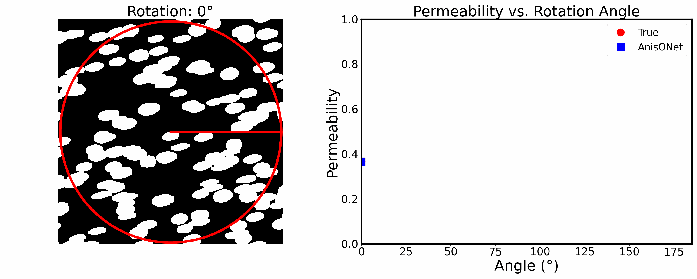

# AnisONet
Machine Learning Pipeline Frameworks to Predict Directional Anisotropic Permeabilities from any initial direction (Zero Degree) Porous Media Image.

NB: Flow is along X-direction (Horizontal Direction) --->

  

