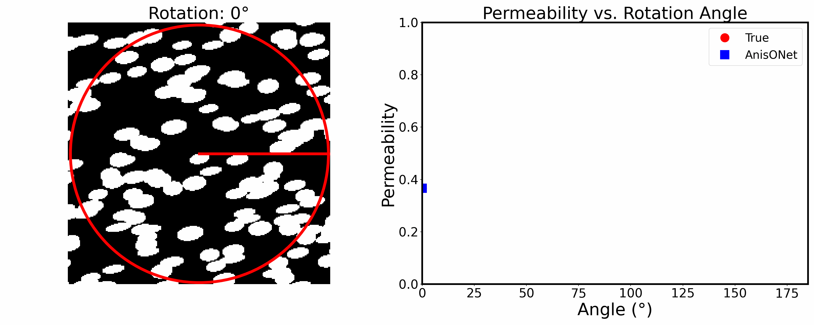

# AnisONet
Machine Learning Pipeline Frameworks to Predict Directional Anisotropic Permeabilities from any initial direction (Zero Degree) Porous Media Image.

NB: Flow is along X-direction (Horizontal Direction) --->

<p align="center">
  
</p>

## Publication

[](https://doi.org/10.1063/5.0312245)

📄 **[AnisONet: A deep neural operator-based anisotropic permeability upscaler from pore to Darcy scale](https://doi.org/10.1063/5.0312245)**
Soumya Shouvik Bhattacharjee, Prokash Chandra Roy, Hongkyu Yoon, Zhengtao Gan
*Physics of Fluids*, **38**(3), 036607, March 2026

### Citation

If you use AnisONet in your research, please cite:

```bibtex
@article{bhattacharjee2026anisonet,
  author  = {Bhattacharjee, Soumya Shouvik and Roy, Prokash Chandra and Yoon, Hongkyu and Gan, Zhengtao},
  title   = {AnisONet: A deep neural operator-based anisotropic permeability upscaler from pore to Darcy scale},
  journal = {Physics of Fluids},
  volume  = {38},
  number  = {3},
  pages   = {036607},
  year    = {2026},
  issn    = {1070-6631},
  doi     = {10.1063/5.0312245},
  url     = {https://doi.org/10.1063/5.0312245}
}
```
